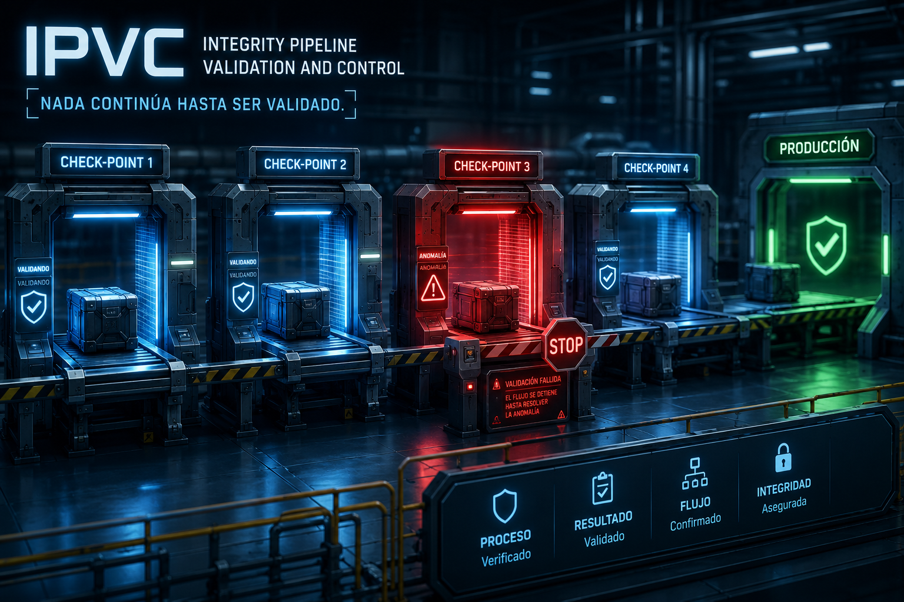
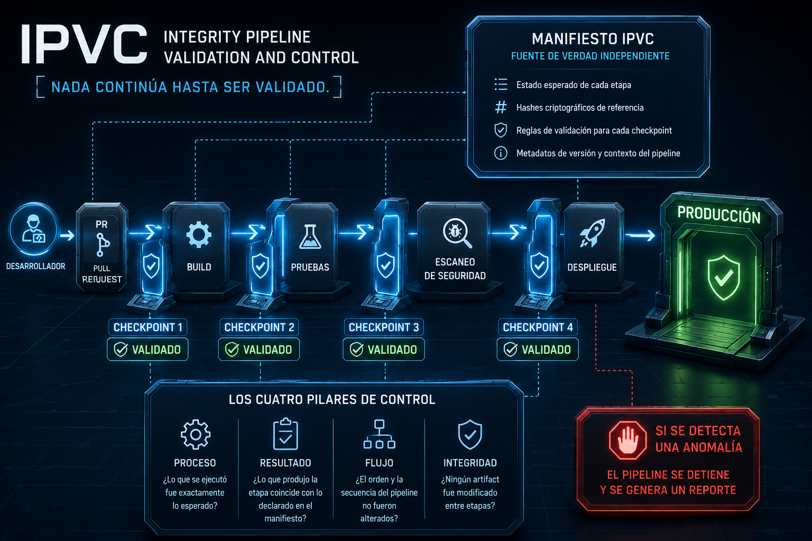
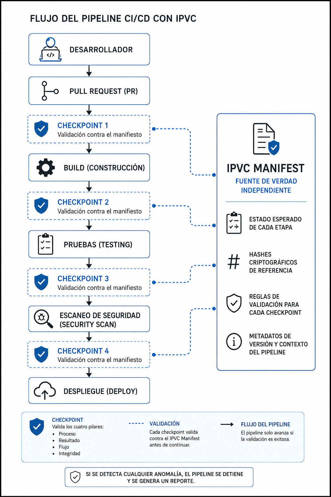

> ℹ️ **Note:** This document is written in Spanish. You can use your browser to translate it into English.
> The Spanish version is preserved intentionally as part of the project's authorship and intellectual identity.

# IPVC — Integrity Pipeline Validation and Control  

## Una propuesta de arquitectura de seguridad para pipelines CI/CD  

**Autor:** Fernando Flores Alvarado  
**Proyecto:** IPVC — Integrity Pipeline Validation and Control  
**Licencia:** CC BY 4.0 (documentación)  
Información detallada sobre versiones, fechas, estado y metadatos completos, consulta [`VERSION.md`](../VERSION.md).  

---
  
*Figura 1. Representación conceptual de IPVC: cada etapa del proceso debe ser validada antes de permitir que el flujo continúe.*
---

> **Nota sobre terminología:** Este documento utiliza algunos términos técnicos ampliamente adoptados en la industria del software y la ciberseguridad, tales como *pipeline*, *build*, *deploy*, *artifact*, *hash*, *check-point* y *manifest*. Estos términos se mantienen en inglés para conservar su significado técnico original y facilitar su relación con estándares, herramientas y documentación internacional. Las explicaciones, análisis y contenido conceptual se presentan en español.

---

## Introducción  

En mayo de 2026, Andrew van der Stock, Director Ejecutivo de OWASP, alertó a la comunidad de líderes sobre un incremento significativo de ataques a la cadena de suministro de software a través de Pull Requests maliciosos:  

> *"We have two recent instances of people or AI bots trying to get mischievous or actually malicious PRs accepted by OWASP projects. These obviously have significant supply chain attacks."*  

Los vectores identificados incluyen código ofuscado, GitHub Actions maliciosas, robo de tokens en pipelines CI/CD y modificaciones no autorizadas de artifacts.  

Este escenario motivó la investigación que dio origen a IPVC.  

La investigación comenzó analizando cómo operan los pipelines CI/CD modernos y qué mecanismos existen para validar la integridad entre sus distintas etapas. Durante ese proceso surgió una pregunta fundamental:  

> **¿Cómo verificar que cada transición del pipeline produjo exactamente el resultado esperado antes de permitir que el flujo continúe?**  

La búsqueda de una respuesta a esa pregunta dio origen a la propuesta presentada en este documento.  

---

## El problema  

Los pipelines de integración y despliegue continuo (CI/CD) son flujos automatizados que transforman código fuente en software desplegado. Este proceso ocurre a través de múltiples etapas secuenciales: revisión de código, análisis de dependencias, construcción, pruebas, escaneo de seguridad y despliegue.  

**El problema central es que no existe un mecanismo formal que valide la integridad del resultado de cada etapa antes de que el proceso continúe.**  

Un atacante que logra introducir código malicioso en cualquier punto del flujo — ya sea mediante un PR comprometido, una dependencia alterada o una GitHub Action modificada — puede hacer que ese código viaje por todo el pipeline sin ser detectado, hasta llegar a producción.  

El flujo actual tiene esta forma:  

```
Desarrollador → PR → Revisión → Build → Pruebas → Escaneo → Deploy
```

En ninguna de estas transiciones existe un punto que responda formalmente a las siguientes preguntas:  

- ¿El proceso que se ejecutó fue exactamente el esperado?
- ¿El resultado que produjo coincide con lo declarado previamente?
- ¿El flujo no fue alterado entre etapas?
- ¿La integridad del artifact se mantuvo desde la etapa anterior?

Esta ausencia es la brecha que IPVC busca cerrar.  

---

## La propuesta — IPVC  

**IPVC (Integrity Pipeline Validation and Control)** es un método de arquitectura de seguridad que introduce puntos de control (*check-points*) entre cada etapa de un pipeline CI/CD, validando que el proceso, el resultado, el flujo y la integridad de cada etapa sean consistentes con lo declarado en un manifiesto de referencia definido al inicio de la ejecución.  

### Los cuatro pilares de control  

IPVC se basa en cuatro pilares fundamentales de validación:  

| Pilar | Descripción | Pregunta de validación |
|---------|-------------|-------------------------|
| **Proceso** | Verifica que la tarea ejecutada sea exactamente la que se esperaba ejecutar. | ¿Lo que se ejecutó fue exactamente lo esperado? |
| **Resultado** | Valida que el resultado producido coincida con el estado previamente declarado. | ¿Lo que produjo la etapa coincide con lo declarado en el manifiesto? |
| **Flujo** | Comprueba que el orden y la secuencia de las etapas no hayan sido alterados. | ¿El orden y la secuencia del pipeline no fueron alterados? |
| **Integridad** | Confirma que ningún artifact haya sido modificado entre una etapa y la siguiente. | ¿Ningún artifact fue modificado entre etapas? |

Cada check-point evalúa estos cuatro pilares antes de permitir que el pipeline continúe.  

### El Manifiesto IPVC  

El componente central del método es el **Manifiesto IPVC**: un documento de referencia que se define antes de la ejecución del pipeline y que permanece separado del proceso mismo, con permisos y credenciales independientes.  

El manifiesto declara:  

- El estado esperado de cada etapa
- Los hashes criptográficos de referencia para cada artifact
- Las reglas de validación para cada check-point
- Los metadatos de versión y contexto del pipeline

---
  
*Figura 2. El manifiesto IPVC actúa como referencia central de validación y supervisa cada check-point del pipeline.*
---

### El flujo con check-points  

---
  
*Figura 3. Arquitectura de referencia de IPVC. Cada transición del pipeline es validada mediante check-points independientes que consultan el manifiesto de referencia.*
---

Si cualquier check-point detecta una discrepancia, el pipeline se detiene y se genera un reporte. El proceso no continúa hasta que la anomalía sea resuelta.  

### El mecanismo de validación  

Inspirado en el mecanismo de verificación de hashes criptográficos utilizado históricamente para imágenes ISO, cada etapa del pipeline genera una huella digital de su resultado. Esta huella se compara contra el valor declarado en el manifiesto.  

Si un atacante introduce código adicional en cualquier etapa, la huella digital resultante no coincidirá con el valor del manifiesto, y el pipeline se detendrá inmediatamente.  

El cálculo de estas huellas se enfoca únicamente en elementos que representan el estado real del resultado generado por cada etapa.  

Variables operativas que pueden variar entre ejecuciones sin afectar la integridad del resultado — como tiempos de ejecución, características del entorno o información específica de la infraestructura donde se ejecuta el pipeline — no forman parte del proceso de validación.  

Por ejemplo, diferencias en el tiempo de ejecución pueden producirse de forma natural debido a procesos concurrentes o variaciones de carga en el sistema, sin representar necesariamente una anomalía de seguridad.  

Los criterios exactos utilizados para la generación y validación de huellas digitales serán desarrollados con mayor detalle en la segunda publicación de esta serie.  

---

## Diferencia con marcos y guías existentes  

Cada uno aborda problemas específicos dentro de la seguridad de la cadena de suministro de software.  

### SLSA (Supply-chain Levels for Software Artifacts)  

SLSA se enfoca en aumentar la confianza sobre *cómo fue construido* un artifact durante el proceso de build. Define niveles de confianza para el artifact resultante, garantizando trazabilidad del proceso de construcción.  

### Sigstore  

Sigstore se enfoca en garantizar la *autenticidad y el origen* de los artifacts mediante firmas criptográficas. Firma ese artifact para garantizar que proviene de quien dice que proviene.  

### OWASP CI/CD Security Cheat Sheet  

La OWASP CI/CD Security Cheat Sheet provee recomendaciones y guías conceptuales para que los equipos de desarrollo aseguren sus pipelines. Describe *qué* se debería hacer: separar credenciales, limitar permisos, auditar dependencias, controlar accesos. Es una referencia de buenas prácticas, no un mecanismo de implementación técnica verificable.  

### IPVC  

IPVC aborda la dimensión que ninguno de los marcos o guías anteriores cubren: **verifica que cada transición del pipeline produzca exactamente el resultado esperado antes de permitir que el flujo continúe**.  

Mientras SLSA protege el proceso de construcción, Sigstore protege la autenticidad del artifact, y la Cheat Sheet describe las prácticas recomendadas, **IPVC implementa y verifica automáticamente que esas prácticas se ejecutaron tal como fueron declaradas** — en cada transición, con un mecanismo criptográfico, sin intervención manual.  

### Tabla — Comparación conceptual   

|  | SLSA | Sigstore | OWASP CI/CD Cheat Sheet | IPVC |
|---|---|---|---|---|
| Enfoque principal     | Confianza del artifact | Autenticidad del artifact | Buenas prácticas        | Integridad del flujo                        |
| Responde a            | ¿Cómo fue construido?  | ¿Quién lo firmó?          | ¿Qué debería hacerse?   | ¿Se ejecutó exactamente como fue declarado? |
| Momento de aplicación | Build                  | Distribución              | Diseño y operación      | Cada transición entre etapas                |
| Validación automática | Parcial                | Sí                        | No                      | Sí                                          |

La diferencia central en una línea:  

> **SLSA y Sigstore protegen el *qué*. La Cheat Sheet guía el *cómo*.**
> **IPVC garantiza que el *cómo* y el *cuándo* se ejecutaron exactamente como fueron declarados.**  

SLSA define niveles de confianza para el artifact resultante. Sigstore firma ese artifact para garantizar su origen. La Cheat Sheet ofrece orientación. IPVC garantiza que el proceso que generó ese artifact no fue comprometido en ninguna de sus etapas intermedias.  

IPVC no reemplaza ni compite con los marcos y guías existentes. Los complementa.  

Los cuatro pueden coexistir y reforzarse mutuamente dentro de una arquitectura integral de seguridad para la cadena de suministro de software.  

---

## Retos identificados  

La implementación de IPVC presenta desafíos que la comunidad deberá abordar:  

1. **Integración en estándares existentes** — IPVC debe definirse dentro del marco de los pipelines CI/CD ya establecidos (GitHub Actions, GitLab CI, Jenkins, entre otros) para facilitar su adopción.

2. **Separación del manifiesto** — El manifiesto debe estar físicamente separado del pipeline, con permisos y credenciales independientes, para que un atacante que comprometa el pipeline no pueda modificar también el manifiesto de referencia.

3. **Selección automática del escaneo correcto** — Una de las etapas más complejas es el escaneo de seguridad, donde existe una gran fragmentación de herramientas. IPVC incluye como componente complementario un registro centralizado y clasificado de escáneres, que permita al pipeline seleccionar automáticamente la herramienta adecuada según el tipo de aplicación.

4. **Velocidad y eficiencia** — Los check-points deben ser lo suficientemente rápidos para no impactar significativamente los tiempos de ejecución del pipeline.

5. **Actualización del manifiesto** — Cuando un mantenedor publica una actualización, debe actualizar también el registro correspondiente en el manifiesto. Esto permite que el desarrollador que consume ese recurso no tenga que preocuparse por la integridad del mismo — el check-point lo valida automáticamente.

---

## Relación con RHC  

RHC (Randomized Header Channel for CSRF Protection) es un proyecto OWASP separado que protege la integridad de los canales de comunicación HTTP. Su relación con IPVC es complementaria y acotada:  

En la etapa de escaneo de seguridad, algunos escáneres realizan consultas a bases de datos de vulnerabilidades en línea (como OSV). La comunicación entre el escáner y esa base de datos externa representa un límite de confianza: si esa comunicación es interceptada y alterada, un atacante podría hacer que una dependencia maliciosa aparezca como limpia.  

Es en ese punto específico — y solo en ese punto — donde RHC puede aplicarse como capa de protección de la comunicación. No como parte central de IPVC, sino como mecanismo de protección en un límite de confianza particular.  

---
**© 2026 Fernando Flores Alvarado — IPVC (Integrity Pipeline Validation and Control)**  
Publicado bajo [Creative Commons BY 4.0](../LICENSE_CC.md).  

> *“Compartir con responsabilidad es inspirar para construir el futuro.”*  
