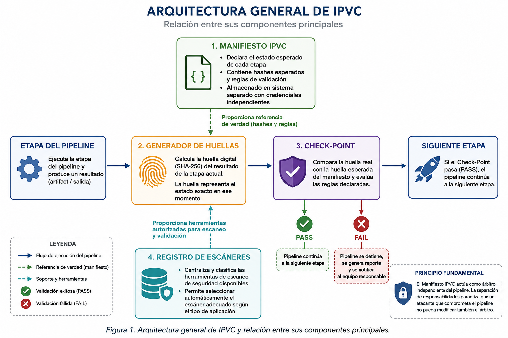
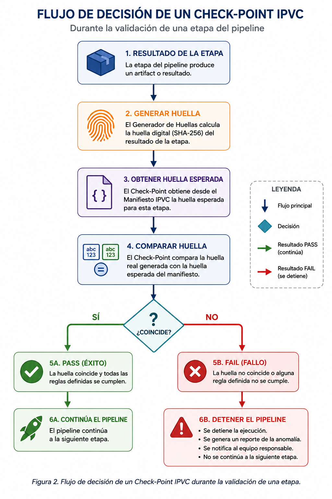
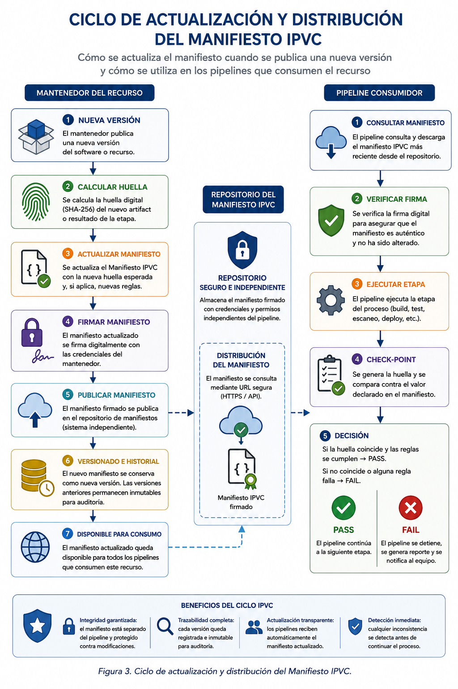
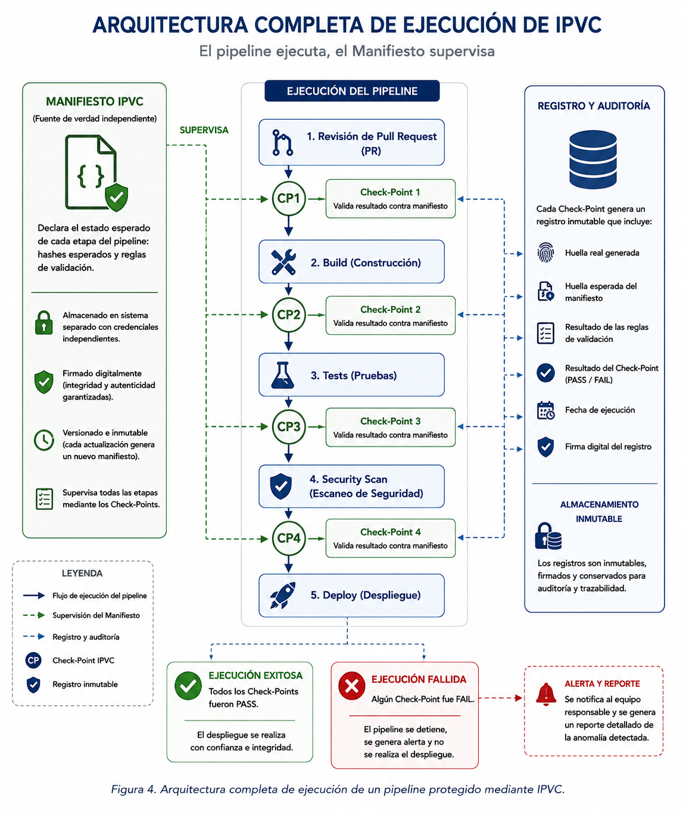

> ℹ️ **Note:** This document is written in Spanish. You can use your browser to translate it into English.
> The Spanish version is preserved intentionally as part of the project's authorship and intellectual identity.

# IPVC — Método de Control: Arquitectura y Especificación Técnica  

## Definición Formal  

**Autor:** Fernando Flores Alvarado  
**Proyecto:** IPVC — Integrity Pipeline Validation and Control  
**Licencia:** CC BY 4.0 (documentación)  
Información detallada sobre versiones, fechas, estado y metadatos completos, consulta [`VERSION.md`](../VERSION.md).  

---

## Introducción

Esta publicación es la continuación técnica de la Publicación 1, donde se introdujo el problema y la propuesta conceptual de IPVC. Aquí se define la arquitectura del método y la especificación técnica de sus componentes.

El documento está organizado en tres niveles de profundidad con separación explícita:

- **Nivel 1 — Básico:** suficiente para entender el método completo
- **Nivel 2 — Intermedio:** ejemplos de cómo implementarlo
- **Nivel 3 — Avanzado:** definiciones formales y pseudocódigo

Cada lector puede detenerse en el nivel que corresponda a su contexto.

---

---

# NIVEL 1 — BÁSICO

## Entender IPVC en términos simples

---

## ¿Qué es un pipeline CI/CD?

Un pipeline CI/CD es una secuencia de pasos automatizados que transforma código fuente en software desplegado. Cada vez que un desarrollador sube un cambio, el pipeline se ejecuta automáticamente: revisa el código, construye la aplicación, la prueba, la escanea y la despliega.

El problema es que este proceso ocurre sin que nadie verifique que cada paso produjo exactamente lo que se esperaba.

## ¿Qué hace IPVC?

IPVC coloca un punto de control entre cada etapa del pipeline. Antes de que el proceso avance al siguiente paso, ese punto de control verifica que todo está en orden.

Si algo no coincide con lo esperado, el proceso se detiene. No continúa hasta que la anomalía sea resuelta.

## ¿Qué es el Manifiesto IPVC?

El Manifiesto IPVC es un documento que se define antes de ejecutar el pipeline. Contiene la descripción de lo que se espera que produzca cada etapa.

Es como una lista de verificación oficial: cuando el pipeline termina cada paso, el check-point compara el resultado real contra lo que dice esa lista. Si coincide, continúa. Si no coincide, se detiene.

El manifiesto vive separado del pipeline, con permisos diferentes, para que un atacante que comprometa el pipeline no pueda modificar también la lista de verificación.

## El flujo completo en términos simples

```
Antes de ejecutar:
  → Se define el Manifiesto IPVC (estado esperado de cada etapa)

Durante la ejecución:
  → Etapa 1 ejecuta
  → Check-point 1 compara resultado con manifiesto → ¿coincide? continúa : detiene
  → Etapa 2 ejecuta
  → Check-point 2 compara resultado con manifiesto → ¿coincide? continúa : detiene
  → ... y así en cada etapa

Si todo coincide:
  → El pipeline completa y el software llega a producción

Si algo no coincide:
  → El pipeline se detiene
  → Se genera un reporte de la anomalía
  → No hay despliegue hasta resolver
```

## ¿Por qué es importante la separación del manifiesto?

Si el manifiesto viviera dentro del pipeline, un atacante que comprometiera el pipeline podría modificar también el manifiesto para que la comparación siempre diera como resultado "todo correcto". Eso eliminaría por completo la protección.

Al mantener el manifiesto separado, con credenciales y permisos independientes, se establece una separación de responsabilidades: el proceso y su árbitro no pueden ser comprometidos simultáneamente con el mismo vector de ataque.

---

---

# NIVEL 2 — INTERMEDIO

## Cómo implementar IPVC en un pipeline real

---

## Arquitectura de componentes

IPVC se compone de cuatro elementos principales:

---
  
*Figura 1. Arquitectura general de IPVC y relación entre sus componentes principales.*
---

### 1. El Manifiesto IPVC

Archivo de referencia en formato estructurado (JSON o YAML) que declara:

```yaml
ipvc_manifest:
  version: "1.0"
  pipeline_id: "proyecto-ejemplo"
  fecha_declaracion: "2026-06-08"
  etapas:
    - nombre: "revision_pr"
      hash_esperado: "sha256:a3f2..."
      reglas:
        - no_codigo_ofuscado
        - no_github_actions_externas
        - no_dependencias_no_declaradas
    - nombre: "build"
      hash_esperado: "sha256:b7c1..."
      reglas:
        - artifact_coincide_con_fuente
        - no_scripts_adicionales
    - nombre: "escaneo_seguridad"
      hash_esperado: "sha256:c9d4..."
      reglas:
        - escaner_autorizado
        - resultado_no_modificado
    - nombre: "deploy"
      hash_esperado: "sha256:d2e8..."
      reglas:
        - artifact_firmado
        - hash_coincide_con_build
```

### 2. El Generador de Huellas

Componente que calcula la huella digital (hash criptográfico SHA-256) del resultado de cada etapa. Esta huella representa el estado exacto del artifact o proceso en ese momento.

**Variables que se incluyen en el cálculo:**
- Contenido del artifact o resultado
- Identificador de la etapa
- Versión del pipeline
- Fecha de ejecución (no hora — ver nota en Nivel 3)

**Variables que se excluyen del cálculo:**
- Tiempo exacto de ejecución
- Identificador del servidor
- Variables de entorno del sistema operativo

### 3. El Check-Point

Proceso de validación que se ejecuta entre etapas. Recibe la huella generada y la compara contra el valor declarado en el manifiesto.

```
Check-Point recibe:
  → huella_real = resultado del Generador de Huellas
  → huella_esperada = valor del Manifiesto IPVC

Decisión:
  → si huella_real == huella_esperada → PASS → pipeline continúa
  → si huella_real != huella_esperada → FAIL → pipeline se detiene + reporte
```
---
  
*Figura 2. Flujo de decisión de un Check-Point IPVC durante la validación de una etapa.*
---

### 4. El Registro de Escáneres

Componente complementario que centraliza y clasifica las herramientas de escaneo de seguridad disponibles, permitiendo al pipeline seleccionar automáticamente el escáner adecuado según el tipo de aplicación que se está construyendo.

```yaml
registro_escaneres:
  - id: "sca-001"
    tipo: "SCA"
    descripcion: "Análisis de composición de software"
    aplica_a: ["nodejs", "python", "java"]
    herramienta: "ejemplo-sca-tool"
  - id: "sast-001"
    tipo: "SAST"
    descripcion: "Análisis estático de código fuente"
    aplica_a: ["todos"]
    herramienta: "ejemplo-sast-tool"
  - id: "dast-001"
    tipo: "DAST"
    descripcion: "Pruebas dinámicas de seguridad"
    aplica_a: ["aplicaciones_web", "apis"]
    herramienta: "ejemplo-dast-tool"
```

## Ejemplo de integración en GitHub Actions

```yaml
name: Pipeline con IPVC

on: [push, pull_request]

jobs:
  ipvc_revision_pr:
    runs-on: ubuntu-latest
    steps:
      - name: Checkout
        uses: actions/checkout@v4

      - name: Generar huella de revisión
        run: ipvc-cli generate --etapa revision_pr --output huella_pr.json

      - name: Check-Point 1 — validar contra manifiesto
        run: ipvc-cli validate --etapa revision_pr --huella huella_pr.json --manifiesto $IPVC_MANIFEST_URL

  ipvc_build:
    needs: ipvc_revision_pr
    runs-on: ubuntu-latest
    steps:
      - name: Build
        run: npm run build

      - name: Generar huella de build
        run: ipvc-cli generate --etapa build --output huella_build.json

      - name: Check-Point 2 — validar contra manifiesto
        run: ipvc-cli validate --etapa build --huella huella_build.json --manifiesto $IPVC_MANIFEST_URL

  ipvc_escaneo:
    needs: ipvc_build
    runs-on: ubuntu-latest
    steps:
      - name: Seleccionar escáner automáticamente
        run: ipvc-cli scanner-select --tipo nodejs --registro $IPVC_REGISTRY_URL

      - name: Ejecutar escaneo
        run: ipvc-cli scanner-run --config escaner_seleccionado.json

      - name: Generar huella de escaneo
        run: ipvc-cli generate --etapa escaneo_seguridad --output huella_escaneo.json

      - name: Check-Point 3 — validar contra manifiesto
        run: ipvc-cli validate --etapa escaneo_seguridad --huella huella_escaneo.json --manifiesto $IPVC_MANIFEST_URL
```

> **Nota:** `ipvc-cli` es el nombre de referencia para la herramienta de línea de comandos de IPVC. Su especificación e implementación forman parte del trabajo futuro del proyecto.

## Ciclo de actualización del manifiesto

Cuando un mantenedor publica una nueva versión de su software, debe actualizar el registro correspondiente en el manifiesto IPVC:

```
Mantenedor publica versión 2.0:
  1. Calcula la huella del nuevo artifact
  2. Actualiza el Manifiesto IPVC con el nuevo hash_esperado
  3. Firma la actualización con sus credenciales
  4. El manifiesto queda disponible para los pipelines que consumen ese recurso

Desarrollador que usa ese recurso:
  → No necesita hacer nada
  → El check-point valida automáticamente contra el manifiesto actualizado
  → Si el artifact descargado coincide con el hash declarado → PASS
  → Si no coincide → FAIL → alerta inmediata
```

---
  
*Figura 3. Ciclo de actualización y distribución del Manifiesto IPVC.*
---

---

---

# NIVEL 3 — AVANZADO

## Definiciones formales y pseudocódigo

---

## Definición formal del Manifiesto IPVC

Sea `M` el Manifiesto IPVC, definido como:

```
M = { id_pipeline, version, fecha, E }

donde E = { e₁, e₂, ..., eₙ } es el conjunto ordenado de etapas declaradas

cada eᵢ ∈ E tiene la forma:
  eᵢ = { nombre, hᵢ_esperado, Rᵢ }

donde:
  hᵢ_esperado = hash criptográfico SHA-256 del resultado esperado de la etapa i
  Rᵢ = conjunto de reglas de validación para la etapa i
```

## Definición formal del Generador de Huellas

Sea `G` la función generadora de huellas, definida como:

```
G(aᵢ, eᵢ, v, f) → hᵢ_real

donde:
  aᵢ = artifact o resultado producido por la etapa i
  eᵢ = identificador de la etapa
  v  = versión del pipeline
  f  = fecha de ejecución (formato YYYY-MM-DD, sin hora ni segundos)

G implementa SHA-256 sobre la concatenación estructurada de los parámetros anteriores.
```

**Justificación de la exclusión del tiempo:**

La hora exacta de ejecución (`HH:MM:SS`) se excluye del cálculo porque múltiples procesos concurrentes en el mismo servidor producen variaciones de tiempo que no representan anomalías reales. Incluir la hora generaría falsos negativos y haría el sistema inestable bajo carga.

La fecha (`YYYY-MM-DD`) se incluye porque establece el contexto temporal de la ejecución sin introducir variabilidad indeseada.

## Definición formal del Check-Point

Sea `CP` el proceso de check-point para la etapa `i`, definido como:

```
CP(hᵢ_real, hᵢ_esperado, Rᵢ) → { PASS | FAIL, reporte }

Algoritmo:

  1. Obtener hᵢ_esperado y Rᵢ desde el Manifiesto M
  2. Calcular hᵢ_real = G(aᵢ, eᵢ, v, f)
  3. Evaluar reglas: ∀ r ∈ Rᵢ → verificar_regla(r, aᵢ)
  4. Si hᵢ_real == hᵢ_esperado AND todas las reglas en Rᵢ son satisfechas:
       → retornar PASS
       → pipeline continúa a etapa i+1
     Si no:
       → retornar FAIL
       → registrar reporte(etapa=i, hᵢ_real, hᵢ_esperado, reglas_fallidas)
       → detener pipeline
       → notificar al equipo responsable
```

## Pseudocódigo del pipeline completo con IPVC

```
FUNCIÓN ejecutar_pipeline_ipvc(codigo_fuente, manifiesto_url):

  M ← cargar_manifiesto(manifiesto_url, credenciales_independientes)
  
  PARA CADA etapa eᵢ EN M.etapas:
    
    resultado_eᵢ ← ejecutar_etapa(eᵢ, codigo_fuente)
    
    hᵢ_real ← G(resultado_eᵢ, eᵢ.nombre, M.version, fecha_hoy())
    
    decision ← CP(hᵢ_real, eᵢ.hash_esperado, eᵢ.reglas)
    
    SI decision == FAIL:
      registrar_fallo(eᵢ, hᵢ_real, eᵢ.hash_esperado)
      notificar_equipo()
      DETENER pipeline
      RETORNAR FAIL
    
    FIN SI
  
  FIN PARA
  
  RETORNAR PASS → proceder con despliegue

FIN FUNCIÓN
```

## Propiedades de seguridad formales

**Propiedad 1 — Detección de modificación:**
Si un atacante modifica el artifact `aᵢ` en cualquier etapa `i`, entonces `G(aᵢ_modificado) ≠ hᵢ_esperado` con probabilidad `1 - 2⁻²⁵⁶`, lo que garantiza la detección en el check-point correspondiente.

**Propiedad 2 — Independencia del manifiesto:**
La integridad del sistema depende de que `M` sea inaccesible desde el vector de ataque que compromete el pipeline. Esto requiere que `M` resida en un sistema con credenciales y permisos estrictamente separados.

**Propiedad 3 — Ordenamiento del flujo:**
El pipeline IPVC es una secuencia estrictamente ordenada. No existe mecanismo para saltar un check-point. La ejecución de la etapa `i+1` requiere `PASS` en `CPᵢ` como precondición.

**Propiedad 4 — No repudio:**
Cada ejecución de check-point genera un registro firmado e inmutable que incluye la huella real, la huella esperada, el resultado de la validación y la fecha. Este registro permite auditar retroactivamente cualquier ejecución del pipeline.

## Consideraciones criptográficas

- **Algoritmo de hash:** SHA-256 como mínimo. Se recomienda SHA-3 para implementaciones de alta criticidad.
- **Firma del manifiesto:** El manifiesto debe estar firmado digitalmente por el autor con un mecanismo compatible con Sigstore (Cosign) para garantizar su autenticidad.
- **Rotación del manifiesto:** Cada actualización de versión genera un nuevo manifiesto firmado. El manifiesto anterior queda archivado e inmutable.
- **Compatibilidad con SLSA:** Los hashes declarados en el manifiesto IPVC pueden derivarse de los attestations generados por SLSA, estableciendo una cadena de confianza entre ambos marcos.

---
  
*Figura 4. Arquitectura completa de ejecución de un pipeline CI/CD protegido mediante IPVC.*
---

---

## Resumen de la arquitectura IPVC

| Componente | Responsabilidad | Ubicación |
|---|---|---|
| Manifiesto IPVC | Declarar el estado esperado de cada etapa | Sistema separado, credenciales independientes |
| Generador de Huellas | Calcular SHA-256 del resultado de cada etapa | Dentro del pipeline |
| Check-Point | Comparar huella real vs esperada y evaluar reglas | Entre cada etapa del pipeline |
| Registro de Escáneres | Centralizar y clasificar herramientas de escaneo | Repositorio externo referenciado por el manifiesto |

---
**© 2026 Fernando Flores Alvarado — IPVC (Integrity Pipeline Validation and Control)**  
Publicado bajo [Creative Commons BY 4.0](../LICENSE_CC.md).  

> *“Compartir con responsabilidad es inspirar para construir el futuro.”*  
